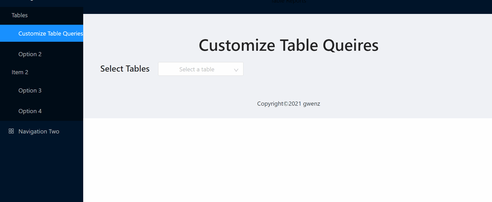

# Ant-Design-Practice
Ant is one of best React UI library for enterprises.
# TableReports

## Some Key Requirements

- [x] the plus button can be clicked multiple times
- [x] once the button get clicked, new `WHERE` clause will be added
- [x] needs to remove the column get selected for former `WHERE` clause
- [x] except first clause, other `WHERE` clauses need to add `ADD` in front to connect each clause1.
- [x] delete each WHERE clause when changed selected table

~~each time only after the user selected the dropdown column, the button can be clicked again~~
- [x] clear each dropdown box when changed selected table
- [x] convert to actual sql
    - [x] select column list can convert to actual sql
    - [x] convert where conditions: convert WHERE variables in backend would be easier e.g. store the value pairs in state then pass to  backend **but how to store the different operations for each WHERE** -- use different fields when storing states when handling values changes in frontend --
```javascript
    /* for each where condition, store the three values together using handleWhereChange method.
    however, need to restrict that only when one where condition lists are selected then user can
     click on the "add" button to add a new where conditon row on the page (?)
    */
    operation: "=", // deafault operation
    beSelected: null,
    inputValue: null, // these three being each where condition values
```
- [ ] **each time only after the user selected the dropdown column, the button can be clicked again**
- [x] how about handling when changing the select lists or where conditions 
- [ ] how to display query result
- [x] restyle customize section
- [x] each table id problem: need to strict that for front end, will always ask user to add an Id field


## Front end of table API


## Current Look

